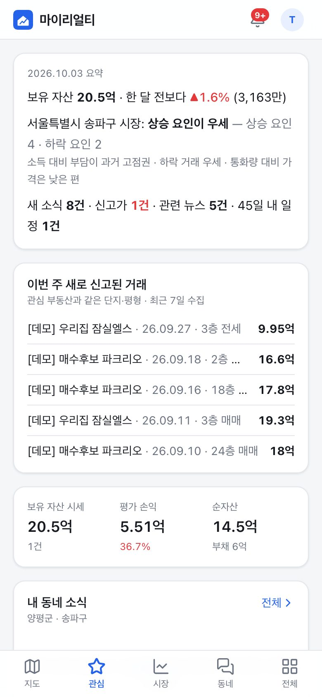
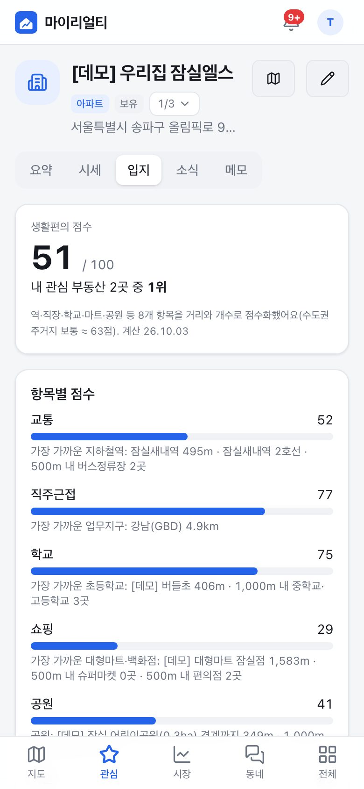
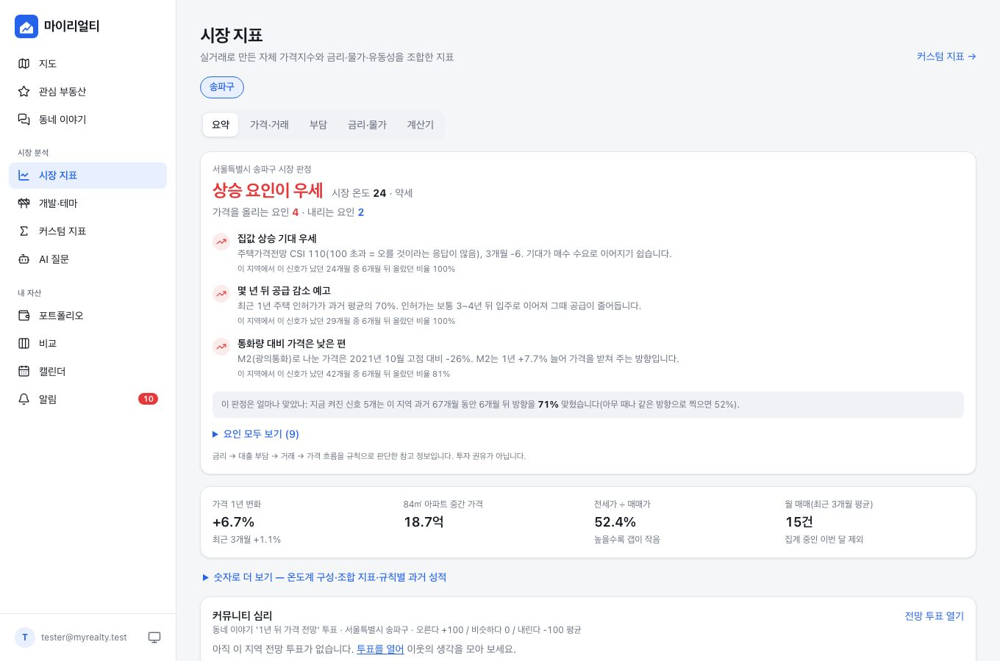

# MyRealty — 나만을 위한 부동산 인텔리전스

공공 DB(실거래가·건축물대장·공시가격·토지이용계획·경제지표 등), 네이버 지도, 뉴스·정책 정보를 결합하고
AI 분석을 더해 **내가 관심 있는 부동산을 중심으로** 시장을 해석해 주는 개인용 웹앱입니다.

<p>



</p>


> 스크린샷은 `seed-demo` 합성 데이터입니다(실제 시세 아님).

## 주요 기능

| 영역 | 기능 |
|---|---|
| 계정 | 이메일 6자리 코드(OTP) 로그인·**누구나 가입**, **이 기기 기억하기(자동 로그인)**, 기기별 세션 관리, 회원 탈퇴 |
| 관리 | `ADMIN_EMAILS` 관리자 전용 **관리 화면**: 가입·활성 통계, 사용자 검색·정지·관리자 지정·기기 로그아웃·삭제, 가입 방식(누구나/허용 목록/중지)·공지·1인당 AI 한도, 시스템 점검(DB·마이그레이션)·**키 점검(Vercel·GitHub 나란히, 실제 호출·지문 비교)**·ETL·AI 사용량, 작업 기록 |
| 관심 부동산 | 상세 화면에서 **다른 관심 부동산으로 바로 전환**(드롭다운·←/→, 보던 탭 유지), 아파트·빌라·오피스텔·단독·토지·임야·상가를 주소로 등록 — **건축물대장·토지특성으로 유형 자동 판별**, **평형 목록(세대수·최근 매매가)에서 선택**(대장에 있는 평형·호 면적만), **동·호 한 칸 입력(903호 → 9층 자동)**, **수집 전 단지도 실거래 바로 조회·위치 미니 지도**, **등록 직후 그 부동산만 바로 수집(진행 표시)**, 금액은 "15억 3000"처럼 입력, 매입·대출·임대 정보, 메모·유형별 체크리스트 |
| 시세·거래 | 실거래 11종 수집(해제·직거래·법인·**미등기** 표시, 전월세 신규/갱신), 가격 차트, **평형별 추이 겹쳐 보기**, **층별 가격 차이**, 신고가·3년 최저 탐지, **추정 시세(AVM)** 구간·신뢰도·백테스트 |
| 주변·비교 | 반경 내 **비슷한 거래**(면적·연식·지목), **유사 단지**(유사도 점수)와 상대 성과, **단지 상세**(관심 부동산이 아니어도 수집된 단지의 평형별 시세·거래·생활편의 점수 → 바로 관심 등록), 유사 단지·주변 거래·지도 라벨을 누르면 그 단지로(내 부동산이면 내 상세로) 이동, **유사 단지 대비 가격 위치(평소 대비 z)**, 최대 5개 **비교**(표·가격 추이·상대 성과) + AI 비교 |
| 입지 | **생활편의 점수**(교통·학교·학원·의료·쇼핑·음식·공원), 지역 내 백분위, **정비사업·철도/도로 사업**, 재건축 연한·용적률 여유, 개통 전후 가격 변화, **재개발·재건축 카드**(소속 구역·단계 안내·대지지분 평당가·신축/분양권 비교), **토지·임야 주변 시장**(지목·용도지역별 ㎡당 중위, 공시지가 배율) |
| 소식 | 키워드 뉴스 + Claude 관련도·호재/악재·요약, 주변 청약·입주 예정, 공시·세금 일정, 캘린더 |
| 지표 | 실거래 기반 **자체 가격지수**, 월부담지수·PIR·실질/유동성 보정·전세가율·회전율·신고가/하락 비율·공급압력·법인 매수·신규/갱신 전세 괴리, **시장 해석**(금리→구매력→거래→가격 규칙 + 과거 적중률), **시장 온도계**, 용어 설명, **커스텀 지표 빌더** |
| 도구 | 대출 시나리오(금리·가격 민감도, DSR), 부동산별 금리 민감도·역전세 점검, 깡통전세 위험 점검, 분양가 vs 주변 시세, 보유세 개략 추정, 포트폴리오 |
| AI | 내 데이터 도구 기반 **질문하기**(스트리밍), 부동산 **분석 카드**, 주간/월간 **리포트**(메일) |
| 알림 | 신규 실거래·신고가·해제·관련 뉴스·주변 청약·만기·금리 변경·온도 구간 변화 → 웹푸시(중요) + 이메일 다이제스트 |
| 지도 | 네이버 지도(키가 없거나 인증 실패 시 브이월드/OSM 대체 지도): 단지별 평당가(㎡/평 설정) 라벨, 유형·매매/전세·기간 필터, 개발사업·지하철·학교·공원·병원·마트·**입주 예정·지적도·용도지역** 레이어, **내 부동산 목록·선택 카드·시세 핀**, **토지·임야 필지 경계(연속지적도) 테두리**, 겹치는 가격 라벨 자동 정리, 상세·등록 화면 미니 지도 |

모바일 우선(PWA, 홈 화면 설치·오프라인 캐시·웹푸시)이며 PC에서는 사이드바 + 2단 레이아웃으로 보입니다. 화면 테마는 시스템·라이트·다크 중에서 고를 수 있습니다(설정, 또는 상단·사이드바의 해·달 버튼).

## 구성

```
apps/web/          Next.js 16 (App Router, React 19, Tailwind 4) — 화면·API·AI(Claude TS SDK)
services/etl/      Python 3.11 (uv) — 수집·지표·AVM·입지·뉴스 분류·알림 (CLI: myrealty)
db/migrations/     Postgres 16 + PostGIS + pgvector 스키마
.github/workflows  CI · 매일 ETL · 정기 리포트
docs/              기획·데이터·아키텍처·지표/AI·로드맵·운영 문서
```

## 빠른 시작 (로컬)

사전 준비: Node 20.9+, pnpm, Python 3.11+, [uv](https://docs.astral.sh/uv/), PostgreSQL 16 + PostGIS + pgvector

```bash
cp .env.example .env              # 최소: AUTH_SECRET, ADMIN_EMAILS
createdb myrealty                 # DATABASE_URL 과 일치하게

cd services/etl
uv sync
uv run myrealty migrate           # 스키마 적용
uv run myrealty seed-demo --email you@example.com   # (선택) 키 없이 확인용 합성 데이터

cd ../../apps/web
pnpm install
pnpm dev                          # http://localhost:3000
```

- SMTP 를 설정하지 않으면 로그인 코드가 `pnpm dev` 콘솔에 출력됩니다.
- `ADMIN_EMAILS` 의 이메일로 로그인하면 사이드바(모바일은 메뉴)에 **관리** 가 보입니다. 배포 점검은 `/api/health`.
- 공공 API 키를 넣고 `uv run myrealty daily` 를 실행하면 관심 부동산이 있는 시군구의 데이터를 모읍니다.
- 키가 빠졌거나 틀렸는지는 관리 → 시스템 → **키 점검**(웹)과 GitHub Actions → **Check keys**(ETL)로 확인한다. `uv run myrealty doctor` 로 로컬에서도 볼 수 있다.
- 데모 데이터 삭제: `uv run myrealty seed-demo --reset`
- 테스트: `cd apps/web && pnpm lint && pnpm typecheck && pnpm test` · `cd services/etl && uv run ruff check src tests && uv run pytest`
  (ETL 테스트는 로컬 Postgres 에 `myrealty_test` DB 를 만들어 사용, `TEST_DATABASE_URL` 로 변경 가능)

배포·스케줄·키 설정은 [06. 배포 · 운영 가이드](docs/06-operations.md)를 보세요.

## 문서

| 문서 | 내용 |
|---|---|
| [01. 제품 기획 · 기능 명세](docs/01-product-features.md) | 사용 시나리오, 화면 구성, 기능 목록과 우선순위 |
| [02. 데이터 소스](docs/02-data-sources.md) | 공공 API 목록, 식별자 체계(법정동코드·PNU), 수집 전략과 제약 |
| [03. 아키텍처 · 데이터 모델](docs/03-architecture.md) | 기술 스택, 인증, ETL, DB 스키마, 디렉터리 구조 |
| [04. 조합 지표 · AI 분석](docs/04-indicators-and-ai.md) | 지표 산식, 생활편의 점수, 유사 부동산·AVM, AI 기능 설계 |
| [05. 로드맵 · 리스크](docs/05-roadmap.md) | 단계별 마일스톤(구현 현황), 비용, 리스크 |
| [06. 배포 · 운영 가이드](docs/06-operations.md) | 키 발급, DB·웹 배포, 스케줄, 운영 팁, 문제 해결 |
| [07. 공개 가입 · 관리자 기능](docs/07-admin.md) | 로그인 오류 원인·수정, 가입 정책, 기기 기억, 관리 화면 설계·테스트 |
| [08. UX 재검토 · 공공데이터 · 거시 인사이트](docs/08-ux-review-and-insights.md) | 부동산 앱 기능 리뷰, 사용자 질문, 화면별 개선, 국토부 데이터 활용, 거시지표 연결 방법 |
| [09. 등록 직후 채우기 · 지도 연결 · 지도 표현 설계](docs/09-watchlist-map.md) | 개별 수집, 등록 화면 실거래·지도, 관심 부동산 ↔ 지도, 공공데이터·조합 지표 지도 표현 계획, 재개발·재건축·토지 정보 |

> 본 앱의 정보·분석은 참고용이며 투자 자문이 아닙니다. AVM·보유세·지표는 공공데이터 기반 추정치입니다.
